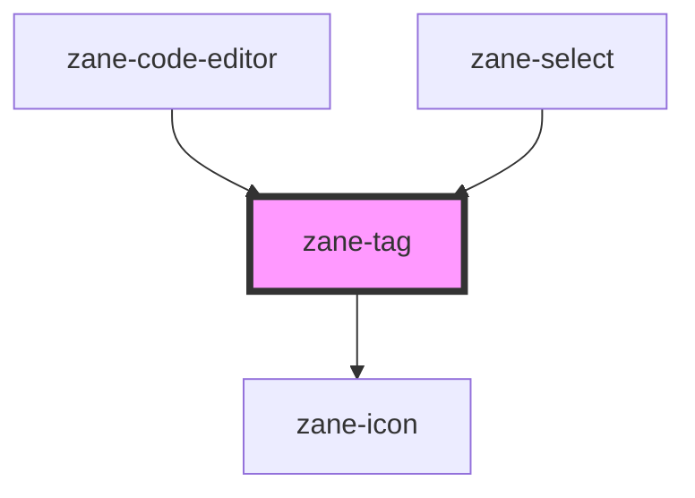

# zane-tag

<!-- Auto Generated Below -->

## Properties

| Property | Attribute | Description | Type | Default |
| --- | --- | --- | --- | --- |
| `color` | `color` | Tag color. Possible values are: 'gray', 'blue', 'green', 'red', 'yellow', 'primary', 'success', 'info', 'warning', 'error'. | `"blue" \| "error" \| "gray" \| "green" \| "info" \| "primary" \| "red" \| "success" \| "warning" \| "yellow"` | `'gray'` |
| `dismissible` | `dismissible` | If true, the tag will have a close icon. | `boolean` | `false` |
| `imageSrc` | `image-src` | Image source. | `string` | `undefined` |
| `selected` | `selected` | If true, the tag will be selected. | `boolean` | `false` |
| `size` | `size` | Text size. | `"md" \| "sm"` | `'md'` |
| `value` | `value` | Tag value. | `string` | `''` |

## Events

| Event | Description | Type |
| --- | --- | --- |
| `zane-tag--click` | Emitted when the tag is clicked. | `CustomEvent<any>` |
| `zane-tag--dismiss` | Emitted when the close icon is clicked. | `CustomEvent<any>` |

## Dependencies

### Used by

- [zane-code-editor](../code-editor)
- [zane-select](../select)

### Depends on

- [zane-icon](../icon)

### Graph

---

_Built with [StencilJS](https://stenciljs.com/)_
