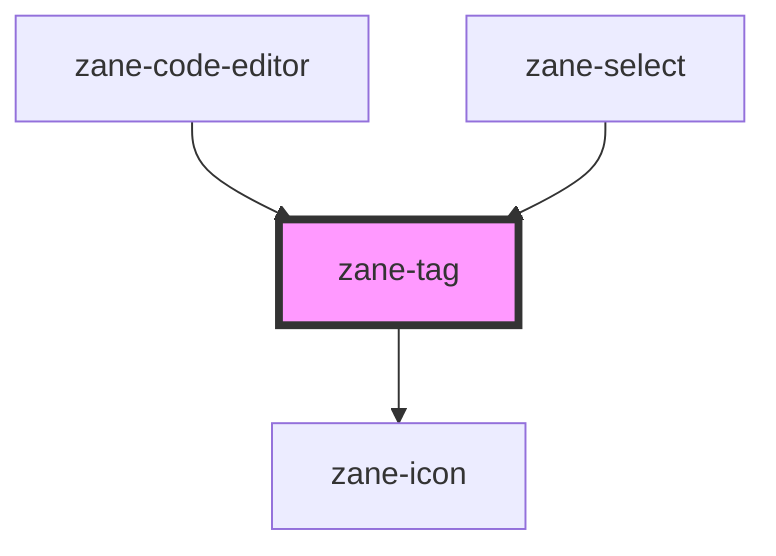

# zane-tag

<!-- Auto Generated Below -->

## Overview

多功能标签/徽章组件

提供灵活的内容展示能力，支持多种颜色主题、尺寸规格、可关闭操作和选中状态。适用于分类标记、状态指示、可选项选择等场景，可与表单组件或列表组件配合使用。

## Properties

| Property | Attribute | Description | Type | Default |
| --- | --- | --- | --- | --- |
| `color` | `color` | 标签颜色主题 提供10种预设颜色方案，满足不同场景的视觉需求： - `blue`: 蓝色主题（中性信息） - `error`: 错误红色（操作失败/危险状态） - `gray`: 灰色主题（默认中性色） - `green`: 绿色主题（成功/完成状态） - `info`: 信息蓝（通知/提示信息） - `primary`: 品牌主色（重要内容） - `red`: 警示红色（紧急通知） - `success`: 成功绿色（操作成功） - `warning`: 警告黄色（注意/提醒） - `yellow`: 强调黄色（高亮显示） | `"blue" \| "error" \| "gray" \| "green" \| "info" \| "primary" \| "red" \| "success" \| "warning" \| "yellow"` | `'gray'` |
| `dismissible` | `dismissible` | 是否显示关闭按钮 设置为 true 时，标签右侧显示关闭图标，点击触发 `zane-tag--dismiss` 事件 | `boolean` | `false` |
| `imageSrc` | `image-src` | 标签图片地址 设置后，在标签左侧显示指定图片（如用户头像） | `string` | `undefined` |
| `selected` | `selected` | 选中状态 表示标签是否被选中，常用于多选场景 | `boolean` | `false` |
| `size` | `size` | 标签尺寸 控制标签的整体尺寸规格： - `md`: 中等尺寸（默认） - `sm`: 小型尺寸（紧凑布局） | `"md" \| "sm"` | `'md'` |
| `value` | `value` | 标签值 标签关联的业务数据值，在事件触发时作为参数传递 | `string` | `''` |

## Events

| Event | Description | Type |
| --- | --- | --- |
| `zane-tag--click` | 标签点击事件 当标签被点击时触发（不包括关闭按钮区域） | `CustomEvent<any>` |
| `zane-tag--dismiss` | 标签关闭事件 当关闭按钮被点击时触发，传递标签的 value 或文本内容 | `CustomEvent<any>` |

## Dependencies

### Used by

- [zane-code-editor](../code-editor)
- [zane-select](../select)

### Depends on

- [zane-icon](../icon)

### Graph

---

_Built with [StencilJS](https://stenciljs.com/)_
