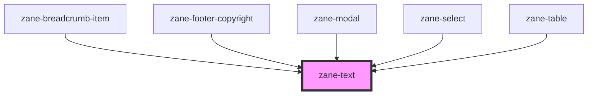

# zane-text

<!-- Auto Generated Below -->

## Overview

多功能文本展示组件

提供丰富的文本样式和语义化支持，满足不同场景的文本展示需求。支持多种文本类型、颜色主题、标题级别和响应式文本大小，集成了完善的 ARIA 可访问性支持。

## Properties

| Property | Attribute | Description | Type | Default |
| --- | --- | --- | --- | --- |
| `color` | `color` | 文本颜色主题 提供7种预设颜色方案，满足不同场景的视觉需求： - `primary`: 主要文本颜色（默认） - `secondary`: 次要文本颜色（较浅） - `tertiary`: 三级文本颜色（最浅） - `error`: 错误状态文本（红色系） - `helper`: 辅助说明文本（灰色系） - `inverse`: 反色文本（深色背景使用） - `on-color`: 彩色背景上的文本 | `"error" \| "helper" \| "inverse" \| "on-color" \| "primary" \| "secondary" \| "tertiary"` | `'primary'` |
| `configAria` | `config-aria` | ARIA 属性配置 用于存储动态收集的 ARIA 属性，提高组件的可访问性。 组件会自动收集元素上的所有 aria-\* 属性并转移到内部元素。 | `any` | `{}` |
| `expressive` | `expressive` | 情感化文本模式 启用特殊的情感化排版样式，通常用于突出重要内容： - 更大的字号间距 - 更丰富的字体变化 - 增强的视觉层次 | `boolean` | `false` |
| `headingLevel` | `heading-level` | 标题语义级别 定义标题的 HTML 语义级别（h1-h6），影响： 1. 文档大纲结构 2. 屏幕阅读器识别 3. SEO 权重 当未指定时，组件会根据标题尺寸自动推导 | `1 \| 2 \| 3 \| 4 \| 5 \| 6` | `undefined` |
| `headingSize` | `heading-size` | 标题视觉尺寸 控制标题的视觉大小（1-7级），与实际语义级别分离： - 1: 最大标题尺寸 - 7: 最小标题尺寸 当未指定时，默认值为： - 普通标题: 7 - 流式标题: 6 | `1 \| 2 \| 3 \| 4 \| 5 \| 6 \| 7` | `undefined` |
| `inline` | `inline` | 行内模式 设置为 true 时，文本将以行内元素（span）渲染， 否则以块级元素（p）渲染 | `boolean` | `false` |
| `type` | `type` | 文本类型 定义文本的语义类型和基本样式： - `body`: 标准正文文本（默认） - `body-compact`: 紧凑正文（较小行高） - `code`: 代码样式（等宽字体） - `fluid-heading`: 流式响应式标题 - `heading`: 标准标题 - `heading-compact`: 紧凑标题 - `helper-text`: 辅助说明文本 - `label`: 表单标签文本 - `legal`: 法律条款小字 | `"body" \| "body-compact" \| "code" \| "fluid-heading" \| "heading" \| "heading-compact" \| "helper-text" \| "label" \| "legal"` | `'body'` |

## Dependencies

### Used by

- [zane-breadcrumb-item](../breadcrumb/breadcrumb-item)
- [zane-footer-copyright](../application/footer/footer-copyright)
- [zane-modal](../modal/modal)
- [zane-select](../select)
- [zane-table](../table)

### Graph

---

_Built with [StencilJS](https://stenciljs.com/)_
