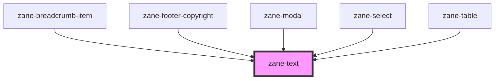

# zane-text

<!-- Auto Generated Below -->

## Properties

| Property | Attribute | Description | Type | Default |
| --- | --- | --- | --- | --- |
| `color` | `color` |  | `"error" \| "helper" \| "inverse" \| "on-color" \| "primary" \| "secondary" \| "tertiary"` | `'primary'` |
| `configAria` | `config-aria` |  | `any` | `{}` |
| `expressive` | `expressive` |  | `boolean` | `false` |
| `headingLevel` | `heading-level` |  | `1 \| 2 \| 3 \| 4 \| 5 \| 6` | `undefined` |
| `headingSize` | `heading-size` |  | `1 \| 2 \| 3 \| 4 \| 5 \| 6 \| 7` | `undefined` |
| `inline` | `inline` |  | `boolean` | `false` |
| `type` | `type` |  | `"body" \| "body-compact" \| "code" \| "fluid-heading" \| "heading" \| "heading-compact" \| "helper-text" \| "label" \| "legal"` | `'body'` |

## Dependencies

### Used by

- [zane-breadcrumb-item](../breadcrumb/breadcrumb-item)
- [zane-footer-copyright](../application/footer/footer-copyright)
- [zane-modal](../modal/modal)
- [zane-select](../select)
- [zane-table](../table)

### Graph

---

_Built with [StencilJS](https://stenciljs.com/)_
