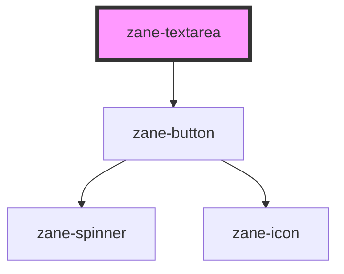

# zane-textarea

<!-- Auto Generated Below -->

## Overview

多功能文本区域输入组件

提供完整的表单文本区域解决方案，支持响应式布局、表单验证、辅助文本提示和丰富的交互功能。集成了 ARIA 可访问性支持和多状态反馈设计，适用于复杂表单场景。

## Properties

| Property | Attribute | Description | Type | Default |
| --- | --- | --- | --- | --- |
| `clearable` | `clearable` | 是否显示清除按钮 设置为 true 时，在输入框有内容时会显示清除按钮 | `boolean` | `false` |
| `configAria` | `config-aria` | ARIA 属性配置 存储动态收集的 ARIA 属性，用于增强组件可访问性。 组件加载时会自动收集宿主元素上的 aria-\* 属性。 | `any` | `{}` |
| `debounce` | `debounce` | 输入事件防抖时间（毫秒） 减少频繁输入事件的处理频率，优化性能 | `number` | `300` |
| `disabled` | `disabled` | 禁用状态 设置为 true 时，组件不可交互且样式变灰 | `boolean` | `false` |
| `helperText` | `helper-text` | 辅助提示文本 显示在输入区域下方的帮助信息 | `string` | `undefined` |
| `inline` | `inline` | 行内布局模式 设置为 true 时，标签和输入框水平排列 | `boolean` | `false` |
| `invalid` | `invalid` | 错误验证状态 设置为 true 时显示错误样式和错误文本 | `boolean` | `false` |
| `invalidText` | `invalid-text` | 错误提示文本 当 invalid 为 true 时显示的错误信息 | `string` | `undefined` |
| `label` | `label` | 输入框标签文本 显示在输入区域上方的描述标签 | `string` | `undefined` |
| `name` | `name` | 表单字段名称 用于表单提交的字段名，默认自动生成唯一值 | `string` | `` `zane-input-${this.gid}` `` |
| `placeholder` | `placeholder` | 占位符文本 输入框为空时显示的提示文本 | `string` | `undefined` |
| `readonly` | `readonly` | 只读状态 设置为 true 时，内容不可编辑但可复制 | `boolean` | `false` |
| `required` | `required` | 必填状态 设置为 true 时，标签旁显示红色星号标记 | `boolean` | `false` |
| `size` | `size` | 尺寸规格 控制输入框的整体尺寸： - `lg`: 大尺寸（48px） - `md`: 中尺寸（40px，默认） - `sm`: 小尺寸（32px） | `"lg" \| "md" \| "sm"` | `'md'` |
| `skeleton` | `skeleton` | 骨架屏状态 设置为 true 时显示加载占位样式 | `boolean` | `false` |
| `state` | `state` | 输入状态标识 控制输入框的视觉状态反馈： - `default`: 默认状态（无特殊样式） - `error`: 错误状态（红色边框） - `success`: 成功状态（绿色边框） - `warning`: 警告状态（黄色边框） | `"default" \| "error" \| "success" \| "warning"` | `'default'` |
| `value` | `value` | 输入值 文本域的当前值，支持双向绑定 | `string` | `undefined` |
| `warn` | `warn` | 警告状态 设置为 true 时显示警告样式和警告文本 | `boolean` | `false` |
| `warnText` | `warn-text` | 警告提示文本 当 warn 为 true 时显示的警告信息 | `string` | `undefined` |

## Events

| Event | Description | Type |
| --- | --- | --- |
| `zane-textarea--action-click` | 操作按钮点击事件 当操作按钮（如清除按钮）被点击时触发 | `CustomEvent<any>` |
| `zane-textarea--blur` | 失去焦点事件 当文本域失去焦点时触发 | `CustomEvent<any>` |
| `zane-textarea--change` | 值变更事件（防抖） 当文本域值变化且经过防抖处理后触发 | `CustomEvent<any>` |
| `zane-textarea--focus` | 获得焦点事件 当文本域获得焦点时触发 | `CustomEvent<any>` |
| `zane-textarea--input` | 输入事件（实时） 当文本域值变化时实时触发 | `CustomEvent<any>` |

## Methods

### `getComponentId() => Promise<string>`

获取组件ID

公开方法，获取组件全局唯一ID

#### Returns

Type: `Promise<string>`

### `setBlur() => Promise<void>`

移除焦点

公开方法，使文本域失去焦点

#### Returns

Type: `Promise<void>`

### `setFocus() => Promise<void>`

设置焦点

公开方法，使文本域获得焦点

#### Returns

Type: `Promise<void>`

## Dependencies

### Depends on

- [zane-button](../button/button)

### Graph

---

_Built with [StencilJS](https://stenciljs.com/)_
