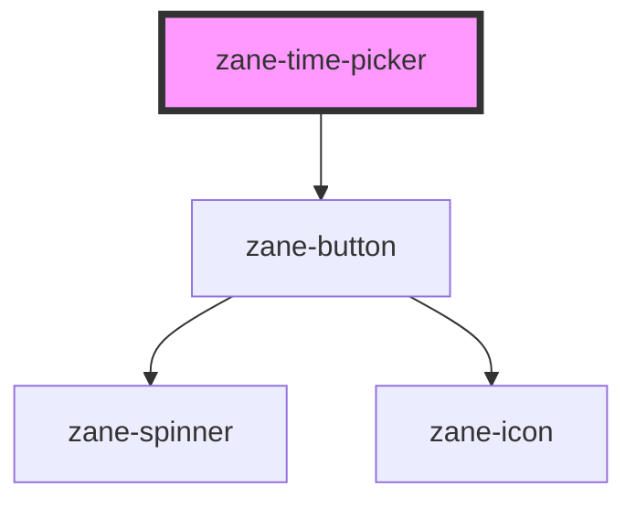

# zane-time-picker

<!-- Auto Generated Below -->

## Overview

时间选择器组件

## Properties

| Property | Attribute | Description | Type | Default |
| --- | --- | --- | --- | --- |
| `configAria` | `config-aria` | 动态收集的ARIA属性配置对象 | `any` | `{}` |
| `disabled` | `disabled` | 禁用状态标志（会反映到DOM属性） | `boolean` | `false` |
| `inline` | `inline` |  | `boolean` | `false` |
| `name` | `name` | 自动生成的表单字段名称 | `string` | `` `zane-input-${this.gid}` `` |
| `placeholder` | `placeholder` |  | `string` | `undefined` |
| `readonly` | `readonly` |  | `boolean` | `false` |
| `size` | `size` |  | `"lg" \| "md" \| "sm"` | `'md'` |
| `value` | `value` | 时间值绑定 | `number \| string` | `''` |

## Events

| Event | Description | Type |
| --- | --- | --- |
| `zane-time-picker--blur` | 当时间选择器失去焦点时触发 | `CustomEvent<any>` |
| `zane-time-picker--change` | 当时间选择器的值发生改变时触发（仅当值实际变化） | `CustomEvent<any>` |
| `zane-time-picker--focus` | 当时间选择器获得焦点时触发 | `CustomEvent<any>` |
| `zane-time-picker--input` | 当时间选择器输入时触发（每次输入都会触发） | `CustomEvent<any>` |

## Methods

### `getComponentId() => Promise<string>`

获取组件实例的唯一标识符

#### Returns

Type: `Promise<string>`

组件实例ID

### `setBlur() => Promise<void>`

主动使时间选择器失去焦点

#### Returns

Type: `Promise<void>`

### `setFocus() => Promise<void>`

主动使时间选择器获得焦点

#### Returns

Type: `Promise<void>`

## Dependencies

### Depends on

- [zane-button](../button/button)

### Graph

---

_Built with [StencilJS](https://stenciljs.com/)_
