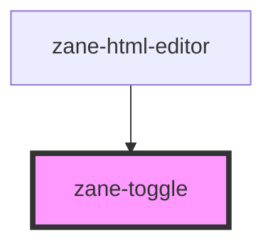

# zane-toggle

<!-- Auto Generated Below -->

## Overview

开关组件

该组件实现了可定制的开关切换控件，支持多种交互状态和样式配置，符合WAI-ARIA无障碍规范，可无缝集成到表单中使用。

## Properties

| Property | Attribute | Description | Type | Default |
| --- | --- | --- | --- | --- |
| `configAria` | `config-aria` | ARIA属性配置对象 | `any` | `{}` |
| `disabled` | `disabled` | 禁用状态 | `boolean` | `false` |
| `label` | `label` | 开关标签文本 | `string` | `undefined` |
| `name` | `name` | 表单字段名称 | `string` | `` `zane-input-${this.gid}` `` |
| `readonly` | `readonly` | 只读状态 | `boolean` | `false` |
| `required` | `required` | 必填状态 | `boolean` | `false` |
| `rounded` | `rounded` | 圆角样式 | `boolean` | `true` |
| `size` | `size` | 开关尺寸 | `"lg" \| "md"` | `'md'` |
| `value` | `value` | 开关值 | `boolean` | `false` |

## Events

| Event                 | Description  | Type               |
| --------------------- | ------------ | ------------------ |
| `zane-toggle--blur`   | 失去焦点事件 | `CustomEvent<any>` |
| `zane-toggle--change` | 值变更事件   | `CustomEvent<any>` |
| `zane-toggle--focus`  | 获得焦点事件 | `CustomEvent<any>` |

## Methods

### `getComponentId() => Promise<string>`

获取组件唯一ID

#### Returns

Type: `Promise<string>`

组件ID

### `setBlur() => Promise<void>`

移除焦点

#### Returns

Type: `Promise<void>`

### `setFocus() => Promise<void>`

设置焦点

#### Returns

Type: `Promise<void>`

## Dependencies

### Used by

- [zane-html-editor](../html-editor)

### Graph

---

_Built with [StencilJS](https://stenciljs.com/)_
