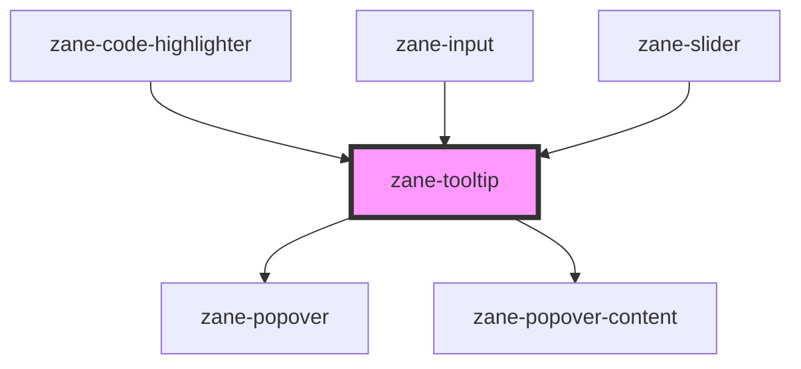

# zane-tooltip

<!-- Auto Generated Below -->

## Overview

工具提示组件 (zane-tooltip)

该组件实现了一个灵活的工具提示系统，可通过悬停或手动触发显示上下文信息。支持四种定位方向，可动态绑定目标元素，并适配无障碍规范。

## Properties

| Property | Attribute | Description | Type | Default |
| --- | --- | --- | --- | --- |
| `content` | `content` | 工具提示内容 | `string` | `''` |
| `placements` | `placements` | 提示框定位方向 | `string` | `'top,bottom,right,left'` |
| `trigger` | `trigger` | 触发方式 | `"hover" \| "manual"` | `'hover'` |

## Dependencies

### Used by

- [zane-code-highlighter](../code-highlighter)
- [zane-input](../input)
- [zane-slider](../slider)

### Depends on

- [zane-popover](../popover/popover)
- [zane-popover-content](../popover/popover-content)

### Graph

---

_Built with [StencilJS](https://stenciljs.com/)_
