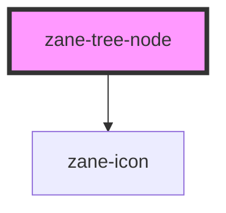

# zane-tree-node

<!-- Auto Generated Below -->

## Overview

树形结构节点组件

## Properties

| Property | Attribute | Description | Type | Default |
| --- | --- | --- | --- | --- |
| `disabled` | `disabled` | 禁用节点交互 | `boolean` | `false` |
| `expanded` | `expanded` | 控制子节点展开状态 | `boolean` | `true` |
| `href` | `href` | 链接地址（存在时节点渲染为<a>标签） | `string` | `undefined` |
| `icon` | `icon` | 节点图标名称（需配合图标库使用） | `string` | `undefined` |
| `label` | `label` | 节点显示文本 | `string` | `''` |
| `level` | `level` | 节点层级（从父节点自动计算） | `number` | `0` |
| `selectedNode` | `selected-node` | 当前选中节点标识符 | `string` | `undefined` |
| `target` | `target` | 链接打开方式（仅在设置 href 时生效） | `string` | `'_self'` |
| `value` | `value` | 节点唯一标识符（优先级高于 label） | `number \| string` | `undefined` |

## Events

| Event                   | Description  | Type               |
| ----------------------- | ------------ | ------------------ |
| `zane-tree-node--click` | 节点点击事件 | `CustomEvent<any>` |

## Methods

### `setBlur() => Promise<void>`

移除元素焦点

#### Returns

Type: `Promise<void>`

### `setFocus() => Promise<void>`

设置元素焦点

#### Returns

Type: `Promise<void>`

## Slots

| Slot | Description                |
| ---- | -------------------------- |
|      | 子节点插槽，用于嵌套树节点 |

## Dependencies

### Depends on

- [zane-icon](../../icon)

### Graph

---

_Built with [StencilJS](https://stenciljs.com/)_
