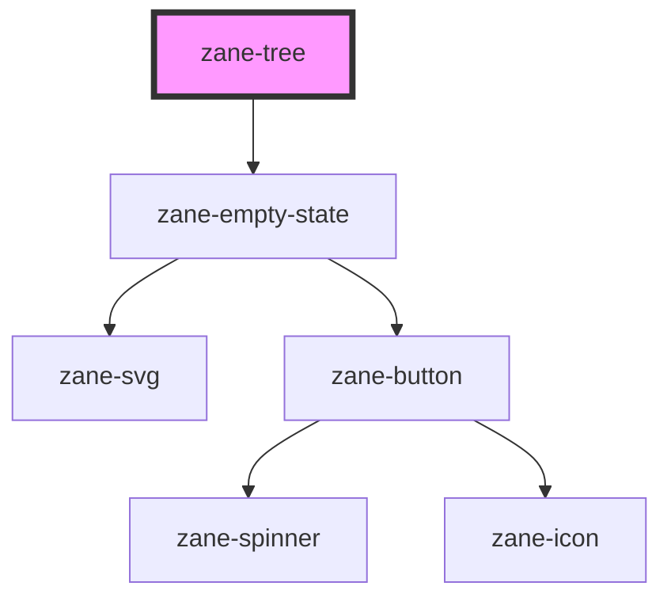

# zane-tree

<!-- Auto Generated Below -->

## Overview

树形结构可视化组件

## Properties

| Property | Attribute | Description | Type | Default |
| --- | --- | --- | --- | --- |
| `empty` | `empty` | 空状态显示开关 | `boolean` | `false` |
| `emptyState` | `empty-state` | 空状态配置（JSON 字符串或对象） | `string` | `` `{     "headline": "No items",     "description": "There are no items to display"   }` `` |
| `selectedNode` | `selected-node` | 当前选中节点标识 | `string` | `undefined` |

## Methods

### `getSelectedNode() => Promise<string>`

获取当前选中节点

#### Returns

Type: `Promise<string>`

当前选中节点的value值

### `setFocus() => Promise<void>`

设置初始焦点

#### Returns

Type: `Promise<void>`

### `subscribeToSelect(cb: any) => Promise<void>`

订阅节点选择事件

#### Parameters

| Name | Type  | Description        |
| ---- | ----- | ------------------ |
| `cb` | `any` | - 选择事件回调函数 |

#### Returns

Type: `Promise<void>`

## Dependencies

### Depends on

- [zane-empty-state](../../application/empty-state)

### Graph

---

_Built with [StencilJS](https://stenciljs.com/)_
